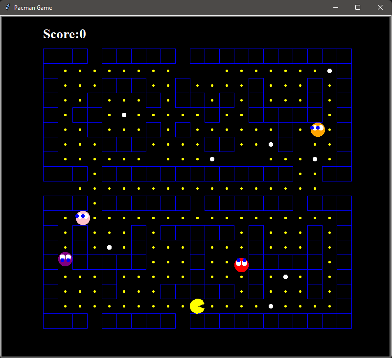

# Image Processing with FPGA
Yih CHENG (https://github.com/chengyih001) 

## Environment
> Python == 3.8.8

## Overview
This is a simple Pacman Game constructed with turtle library in python.

## Conditions
### Scoring :  
When eating a normal food , the score increments by 1.  
When eating a bonus food , the score increments by 5.  

### Win :
When Pacman  finishes eating all the food in the maze
### Lose : 
When Pacman touches a ghost .

## Game Maze

  

